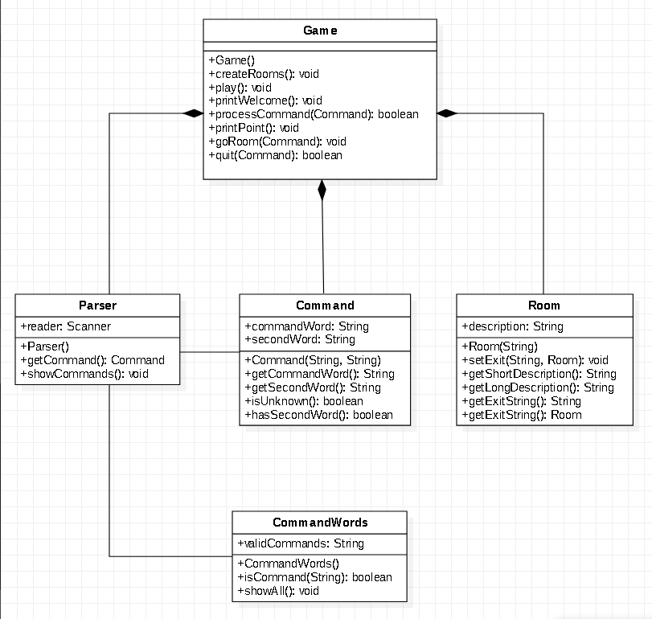

##UML类图

---

##样例工程代码结构分析

* Main类：

  主方法创建Game()对象，通过接口play运行程序

* Game类：

  创建解析器parser对象和地图Room对象，在构造函数中定义并初始化了5个Room信息和parser对象

  调用play()方法之后，Game()对象调用printWelcome打印信息，调用parser的getCommand()方法获取用户的输入
  
  获取用户输入后，Game()对象调用processCommand方法处理用户的命令
  
  processCommand方法调用Command类的方法处理用户命令，判断用户命令是否是有效命令，指向条件判断对应的的方法
  
* Parser类
  
  创建解析器，解析用户输入并显示有效命令
  
* Room类
  
  创建地图描述和出口
  
* Command类

  检测用户输入，返回对应命令
  
* CommandWords类

  设置合法命令，向用户显示、

---

##改进功能

*  待改进部分

    > 提示：样例工程的代码结构存在一些可以改进的功能点，可参考下列说明进行改进：
    >
    > 在Game类的processCommand()方法中，当用户输入的命令被辨认出来以后，有一系列的if语句用来分派程序到不同的地方去执行。从面向对象的设计原则来看，这种解决方案不太好，因为每当要加入一个新的命令时，就得在这一堆if语句中再加入一个if分支，最终会导致这个方法的代码膨胀得极其臃肿。如何改进程序中的这个设计，使得命令的处理更模块化，且新命令的加入能更轻松？请描述你的解决思路，并对你的解决方案进行实现和测试。

*  改进方式

   将if-else多条件判断改为策略工厂模式(加入命令数量较多时)
   
   tips：把修改方案保存在imp包下
   
#### 优点：
   
   1. 逻辑清晰。当命令数量增大到一定的程度时，原本的if-else结构需要比较多的分支来实现需求，导致代码臃肿
   
   2. 易于维护。需要更改某一个命令的功能时，只需要更改对应类中的方法函数
   
   3. 方便添加其他功能。策略工厂模式只需要添加一个新命令的处理程序(类)，另外还需要在factory中添加一个元素，不需要考虑对代码其他部分的影响
   
   4. 减少了主类Game的代码量；原本的if-else结构中，处理命令的方法都在Game类中，造成了Game类代码臃肿，使用了工厂策略模式之后原有的Game类中功能代码被分在独立的类中
   

  
